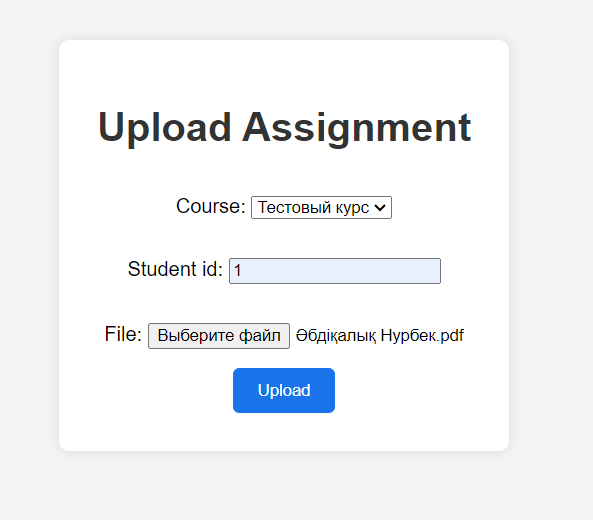

# Django-приложение для интеграции с Open edX

## Обзор

Это Django-приложение позволяет студентам загружать файлы с заданиями для курса на платформе Open edX

## Необходимые условия

- Python 3.9+
- Django 4.2.13
- Экземпляр Open edX (настроенный с помощью Tutor)

## Установка

1. **Клонируйте репозиторий:**
    
  

2. **Создайте виртуальное окружение и активируйте его:**
   
    python -m venv venv
    venv\Scripts\activate
   

3. **Установите зависимости:**
    pip install -r requirements.txt
  

4. **Настройте переменные окружения:**
    Создайте файл `.env` в корневой папке проекта и добавьте следующие переменные окружения:
    ```env
    OPEN_EDX_API_URL=http://local.edly.io
    OPEN_EDX_CLIENT_ID=your_client_id_from_admin_panel
    OPEN_EDX_CLIENT_SECRET=your_client_secret_from_admin_panel
    OPEN_EDX_USERNAME=your_admin_username
    OPEN_EDX_PASSWORD=your_admin_password
    ```

5. **Примените миграции:**
    python manage.py makemigrations
    python manage.py migrate
  

6. **Запустите сервер разработки:**
    python manage.py runserver
 

## Использование
1. **Просмотр существующих курсов:**
    Перейдите по адресу `http://127.0.0.1:8000/file_upload/upload/`

    

2. **Загрузка файлов с заданиями:**
    Перейдите по адресу `http://127.0.0.1:8000/file_upload/upload/` для загрузки файлов.

     

4. **Просмотр загруженных файлов:**
    Перейдите по адресу `http://127.0.0.1:8000/file_upload/files/` для просмотра списка загруженных файлов.

    
    
## Структура файлов

- `file_upload/models.py`: Содержит модели `Course` и `Assignment`.
- `file_upload/forms.py`: Содержит форму `AssignmentForm`.
- `file_upload/views.py`: Содержит представления для отображения курсов, загрузки файлов и просмотра загруженных файлов.
- `file_upload/templates/file_upload/`: Содержит HTML-шаблоны для отображения представлений.

## Интеграция с Open edX

Приложение взаимодействует с платформой Open edX для получения информации о курсах и управления аутентификацией пользователей. Это достигается с помощью Open edX API и OAuth2 для аутентификации.


